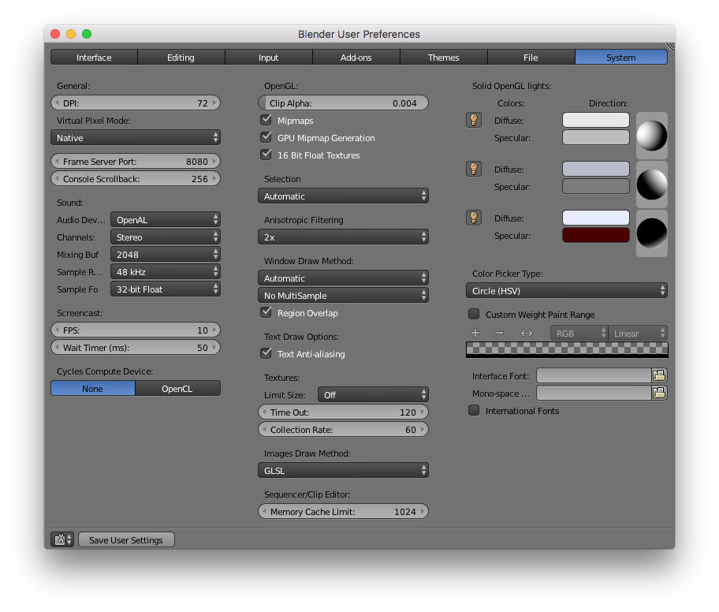

# Blender Custom User Preferences

To find out where Blender user preferences are stored on your machine run the following command in its Python Console.

```
bpy.utils.user_resource('CONFIG')
```

The result should be something along these lines:
```
// Linux
~/.config/blender

// Mac
/Users/username/Library/Application Support/Blender/

// Windows
%APPDATA%\Roaming\Blender Foundation\Blender
```

Within, sub-folders correspond to the versions of Blender that have been used on the machine: `2.77`, `2.78`, et cetera. Focus on the folder for your current version. Within each version folder the `config` directory should contain `startup.blend` and `userpref.blend`, the files that store user preferences. The path should be similar to `/Users/username/Library/Application Support/Blender/2.78/config/`.

To copy the settings of this repository to your machine, replace those existing files on your machine with these:
* [startup.blend](startup.blend)
* [userpref.blend](userpref.blend)

Or for only the input settings (key configuration), open the `User Preferences` window via `File > User Preferences...`. Navigate to the `Input` tab, click the `Import Key Configuration...` button, and import this file:
* [keyconfig.py](keyconfig.py)


# Documentation of changes to the standard user preferences.

A `✓` next to an item indicates that it is now enabled (standard setting was disabled). A `☐` next to an item indicates that it is disabled (standard setting was enabled). An `X` is an option that may not always be necessary, but should be noted for possible activation. Items within brackets (`[]`) reference a standard setting; a correlating custom setting will be indicated. Settings with quotation blocks are under consideration or in a trial period.

## Changes made within the User Preferences window:

### Interface


#### Display

✓ Global Scene

#### View Manipulation

✓ Auto Depth

✓ Zoom To Mouse Position

✓ Auto Perspective

Smooth View: 500

☐ Manipulator

___

### Editing

___

### Input

Select With: Left

#### View2D


#### 3D View

##### 3D View (Global)

Set 3D Cursor [Action Mouse]: ✓ Cmd (Cmd Action Mouse)

Context Toggle Values [Alt Z]: Change first value to `TEXTURED`, second to `MATERIAL`.


☐ Rotate View [Mouse/Trackpad Pan]

Zoom View [Mouse/Trackpad Zoom]: Mouse/Trackpad Pan

Align Camera To View [Ctrl Alt Numpad 0]: ☐ Ctrl ☐ Alt ✓ Cmd (Cmd Numpad 0)

___

### Add-ons

✓ Node Wrangler

X [Animation Nodes](https://github.com/JacquesLucke/animation_nodes)

X [Sverchok](https://github.com/nortikin/sverchok)
___

### Themes

___

### File

___

### System



Images Draw Method [2D Texture]: GLSL
✓ Regional Overlap


___

## Changes made within the GUI:

### Info Window

Render Engine [Blender Render]: Cycles Render

###
